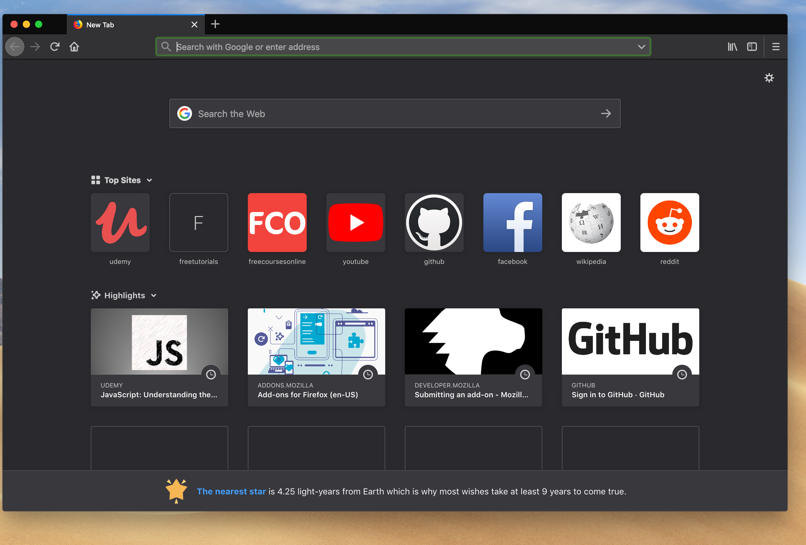
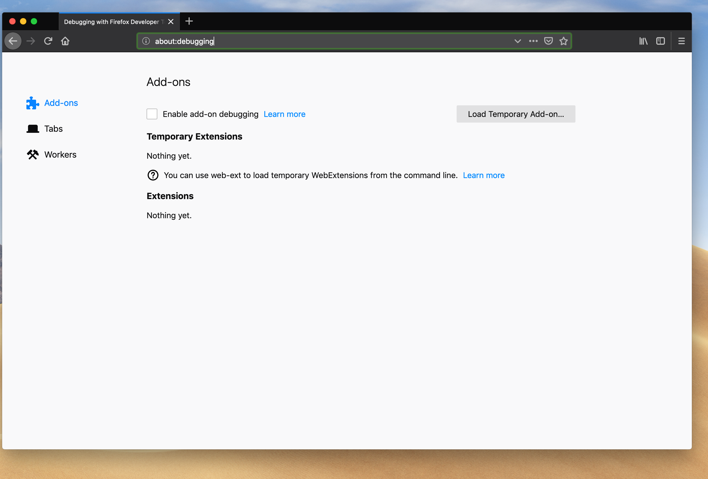
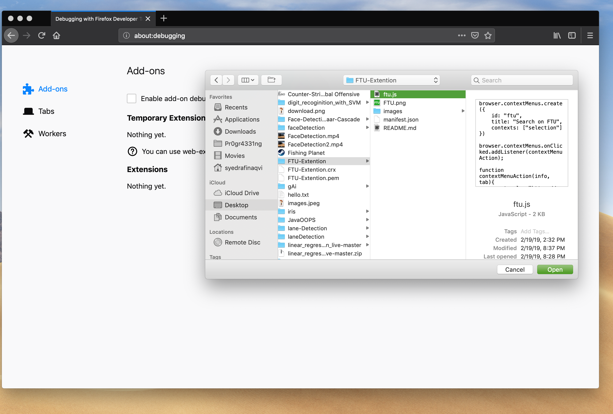

# FTU-Extention

This extention helps to search courses directly in website FTU...!

# step 1 :

Open all time favourite...., mozilla firefox browser.

# step 2 :

Search "about:debugging" in the url which leads to access the local Extentions.

# step 3 :

Press "Load Temporary Add-on" to open files, select ftu.js from downloded files.

# step 4 :

Open any site like udemy, coursera, edx....Here I am opening udemy (fav😍).

# step 5 :

Search for any course to learn.

# step 6 :

Select the title of the course and right click,(😲) you will get an option "Search on FTU" click on it.

# step 7 :

BOOM 💥💥  you will redirect to FTU (Region of Dimonds), you can download desired course..!😃

